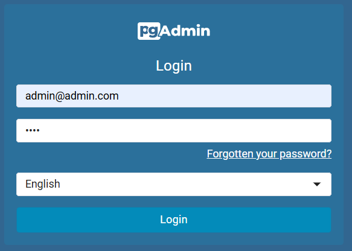
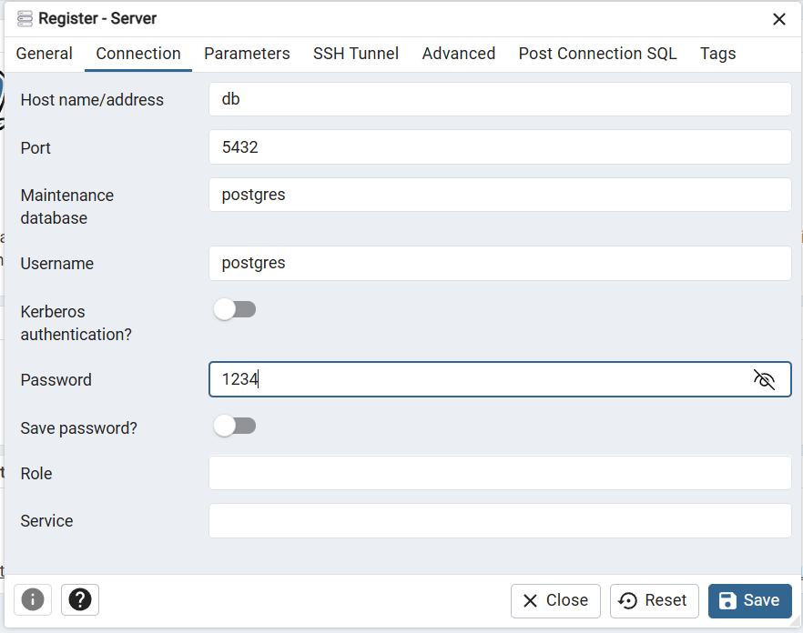

## 🐘 Hướng dẫn sử dụng pgAdmin Web (PostgreSQL Admin)

Sau khi chạy `docker-compose up --build` thành công, bạn có thể sử dụng **pgAdmin4** để quản lý database PostgreSQL.

### 📍 Các thông tin kết nối:

| Thông tin   | Giá trị                         |
|-------------|----------------------------------|
| URL         | http://localhost:5050            |
| Email đăng nhập | `admin@admin.com` (mặc định trong docker-compose) |
| Mật khẩu đăng nhập | `root` (mặc định trong docker-compose) |
| Hostname (khi add server) | `db` |
| Username    | `postgres` |
| Password    | `1234` |
| Database Name    | `chat-app-project` (đặt gì cũng được)|

---

### 🚀 Các bước thực hiện:

1. **Mở trình duyệt** → truy cập `http://localhost:5050`
   
2. **Đăng nhập pgAdmin4**
   - **Email:** `admin@admin.com`
   - **Password:** `root`
   
3. **Add New Server**:
   - Click **Add New Server** ➡️ tab **General**:
     - **Name:** Đặt tên tùy ý, ví dụ: `Chat App DB`
   - Sang tab **Connection**:
     - **Host name/address:** `db`
     - **Port:** `5432`
     - **Username:** `postgres`
     - **Password:** `1234`
     - ✅ Tích **Save Password** để lần sau không cần nhập lại.
   
4. **Save** ➡️ Bây giờ bạn sẽ thấy database `chat-app-project` và có thể:
   - Xem dữ liệu bảng
   - Thực thi các truy vấn SQL
   - Backup / Restore dữ liệu

---

### 🧠 Lưu ý

- **Hostname `db`** là tên container `postgres-db` được định nghĩa trong `docker-compose.yml`.
- **Không dùng `localhost`** khi điền hostname trong pgAdmin, vì pgAdmin và database đều nằm trong **mạng Docker nội bộ**.

### Hình ảnh

- Điền thông tin giống như hình

  

  
